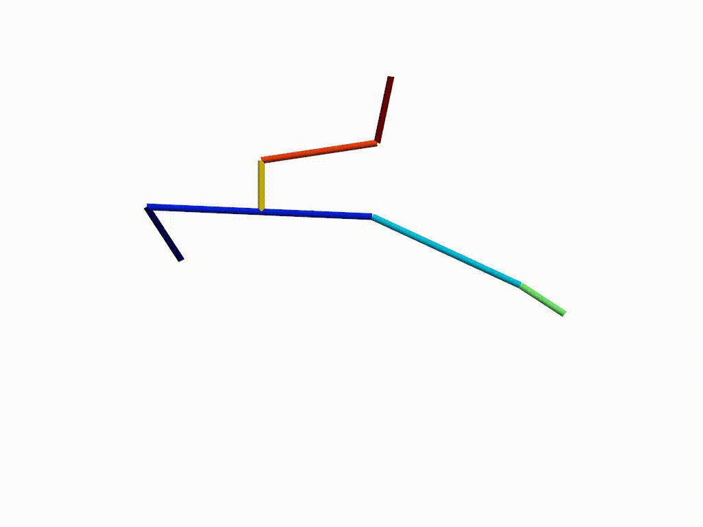

# Spring Decomposed Dynamic Skinning
 This repository demonstrates a dynamic deformation achieved by adding spring helper bones to an 
existing geometric skinning pipeline. Note that it's a work in progress. Currently you can run either 
the files under ./tests/ or ./demo/ directories, e.g. ``python ./tests/spring_bone_test.py``.

### TO-DO

[ok] Integrate an animation visualizer (either by a  library or completing visualizer.py files) that renders 
every frame of animation given a sequence of meshes for every frame (note that it's not a real-time rendering)

[ok] Construct a mass-spring lattice 

- ~~Bind a mass-spring latice to parent bones to inherit rigid bone transformations~~ postponed

[ok] Implement FK/~~IK~~ required to compute transforms for each bone 

- Use optimal rigid motion for springs transforms

[ok] Bind vertices to bones for skinning weights 

- Visualize skinning deformation 

- Update instructions to use this repo