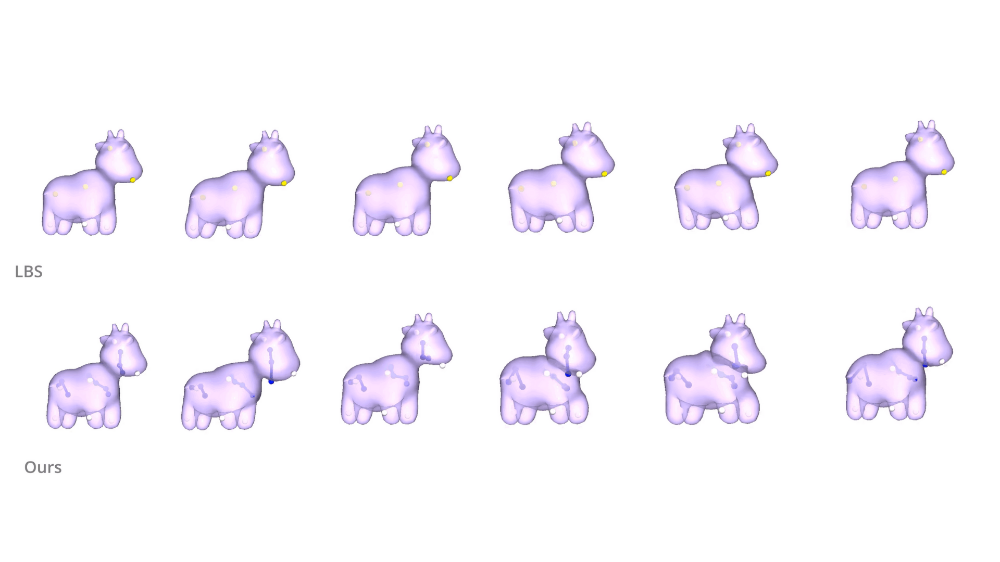

# Spring Decomposed Skinning (SDS)

**Figure 1:** Results of our simulated dynamics. We automatically introduce dynamic stretch and squish deformation with the help of spring forces.

This repository demonstrates a novel approach to **dynamic skinning deformation** using **spring bones**. Traditional skinning methods often lack secondary motion (e.g., jiggling), which limits their realism. Our method introduces dynamic motion into existing skinning pipelines by physically simulating bones, combining the accuracy of physical simulation with the computational efficiency of traditional skinning.


### Key Features

- **Dynamic Motion with a simple framework:** We implement simple Hookean spring forces directly on the rig bones with Position-Based Dynamics (PBD) to emulate secondary dynamics caused by the skeletal motion. 
- **No Tetrahedralization Required:** Unlike most physical simulation methods, we avoid computationally expensive tetrahedralization while still achieving realistic dynamics.
- **Scalability:** We avoid any simulation on the surface vertices which allows us to scale higher resolution meshes just like the traditional skinning pipelines.
- **User-Controlled Dynamics:** Intuitive control over the global and local deformation dynamics is achieved by leveraging spring forces on primary bones and helper bones.
 
 > [!WARNING]
 > It might take some time to load all the GIFs on this page.

## Visual Demo
Our method effectively captures secondary motion dynamics that would otherwise require manual bone positioning for each keyframe.


**Figure 2.1:** A plant pot is shaken right to left. Traditional skinning methods cannot automatically capture the secondary dynamics.

**Figure 2.2:** A rubber duck is rotated back and forth. Our deformation introduces dynamic effects as if the duck is floating on the water without any complex simulation over the surface.

In the figures above, blue bones are simulated within our framework. We automatically compute the dynamic motion, which would be cumbersome to replicate using traditional skinning method as the 3D artist would have to manually position the bones at each keyframe.  


**Figure 2.3:** A piece of cloth is moved back and forth. 

In Figure 2.3, we emulate dynamics for a piece of cloth using a limited set of spring bone chains. 
Unlike traditional garment simulations, which rely on mass-spring systems for every mesh edge, our method remains resolution-independent.


## Comparison Wu et al. (2023)

We compare our results with another method that unifies physical simulation with the skinning framework, Controllable PBD 
by Wu and Umetani [1]. 


Here the yellow dots represent the point handles that are transformed by the user. 
The same handles are transformed for both Wu et al. and our work. 
The red dots represent the point handles that are fixed in Wu et al.'s controllable PBD work and green ones are dynamic handles that are positioned by controllable PBD framework. 
For the details of their implementation, please refer to [their webpage](https://yoharol.github.io/pages/control_pbd/). 

In our work, blue handles represent the spring bones that are simulated in our pipeline. 
We can achieve both global secondary dynamics that jiggles major body parts of the mesh, 
and local secondary dynamics for soft tissues (such as jiggling of a fat tissue). The blue point handles on the above figure are bound to larger areas of the mesh; hence, they can produce global dynamics.

## Local Dynamics with Helper Bones


To introduce jigglings on local areas, we utilize helper bones that are additional bones in the rig. Helper bones are often placed perpendicular to the rigid bones to produce  dynamics that cannot be captured by the rigid bones. In the figure above, we place the helper chains that are bound to smaller local areas on a mesh. These helper chains emulate jigglings of the soft tissues. The yellow handles are moved by the user that creates the rigid motion, then the blue helper spring chains are simulated via PBD, that produces the jiggling of the soft tissues.


## Installation Steps

**Step 1** It's recommended to first create a virtual environment:
```
$ python -m venv venv
$ source venv/bin/activate
```
**Step 2** Inside the project directory, install the dependencies:
```
$ pip install -r requirements.txt
```

**Step 3** To run a demo, change directory to ``/demo`` and run the relevant script:
```
$ cd demo
$ python spot_demo.py
```

> [!TIP]
> To deactivate the virtual environment, use:
>
> `` $ deactivate ``

**Download Data**
 
For DFAUST demos, the relevant dataset should be downloaded from (link here). This step is not required for other demos as their relevant data is included in the ``/data`` directory.

> [!WARNING]
>  Note that this repo is a work in progress. Currently you can run either the files under ``./tests/`` or ``./demo/`` directories. (You may need to change directories to run them)

## References
[1] . Wu and N. Umetani, “Two-way coupling of skinning transformations and
position based dynamics,” Proc. ACM Comput. Graph. Interact. Tech., vol. 6, Aug. 2023.


## TODO
[ ] Allow running from the directory ./test/test_file.py (change step 3)

[ ] Add instructions for setting up DFAUST data

[ ] Add references to PyVista and other source code
